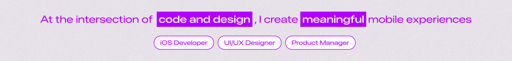
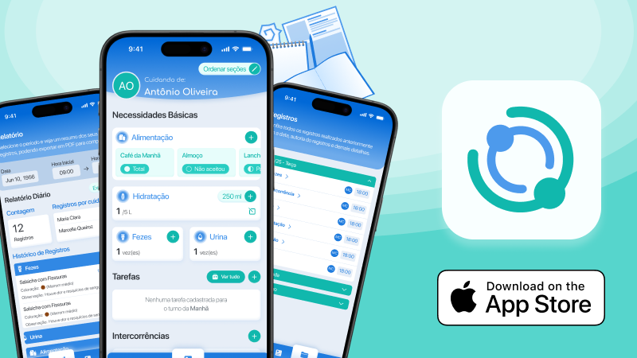
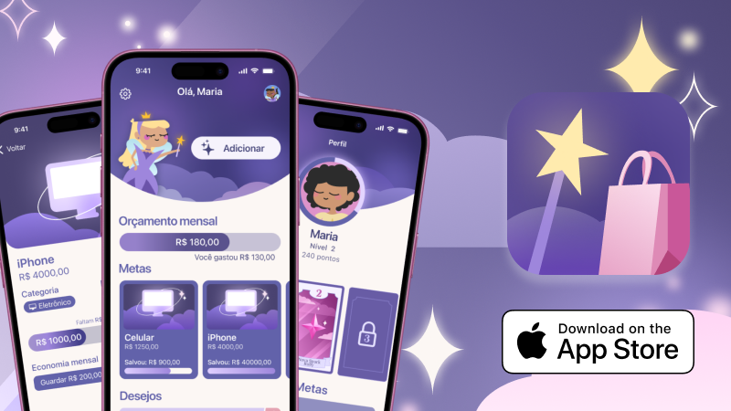
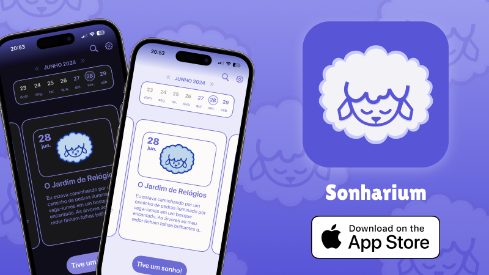

<!-- Header with animated SVG (hosted in repo at assets/header.svg) -->

  

  
  
  
  
  
  
  
  
  
  

  
  Apple Developer Academy Alumni 

  
  Telecommunications Engineering Student at IFCE Fortaleza   

  
  iOS Mobile Developer (Swift, SwiftUI, UIKit)

  
  Mobile UI/UX Designer 

## About Me
Currently, I dedicate myself to iOS development, working with SwiftUI, UIKit, SwiftData, and CoreData, in addition to having experience in UI/UX Design for mobile applications. My goal is to create intuitive, efficient solutions with an exceptional user experience.

## Featured Projects

  <table>
    <tr>
      <!-- CARD 1  ALTROO -->
      <td align="top" width="300">
        
        <h3><a href="https://apps.apple.com/br/app/altroo/id6754249731">Altroo</a></h3>
        

          An application developed for professional caregivers, focusing on usability and information sharing.
        

        

          
          
        

      </td>
      <!-- CARD 2 INTO THE CAULDRON -->
      <td align="top" width="300">
        
        <h3><a href="https://apps.apple.com/br/app/into-the-cauldron/id6745516421">Into the Cauldron</a></h3>
        

          In the game Into the Cauldron, you'll mix magical ingredients, serve super peculiar customers, and create unique potions full of unexpected effects!
        

        

          
          
          
        

      </td>
      <!-- CARD 3 WANTY -->
      <td align="top" width="300">
        
        <h3><a href="https://apps.apple.com/br/app/wanty/id6737251920">Wanty</a></h3>
        

          Organize all your desires in one place and create personalized goals to achieve each one. Plus, unlock rewards as you progress on your journey.
        

        

          
          
        

      </td>
      <!-- CARD 4  SONHARIUM -->
      <td align="top" width="300">
        
        <h3><a href="https://apps.apple.com/br/app/sonharium/id6504766911">Sonharium</a></h3>
        

          You can record your dreams, get information about the different types of dreams, and receive reminders so you don't forget to write them down.
        

        

          
          
        

      </td>
  </table>

## Contact

  
    
  

